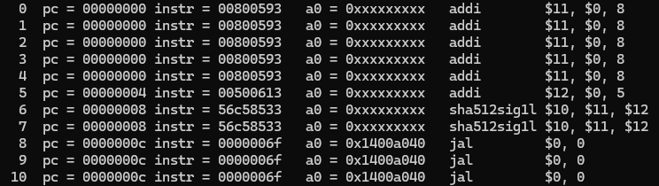
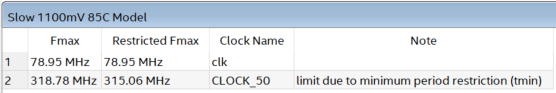
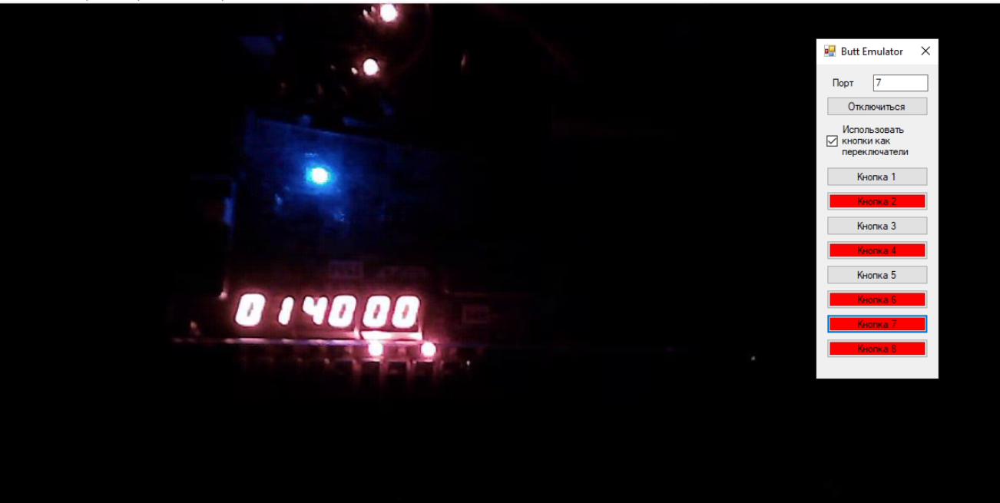
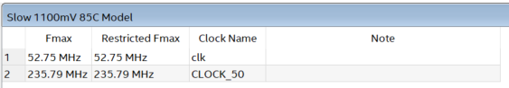
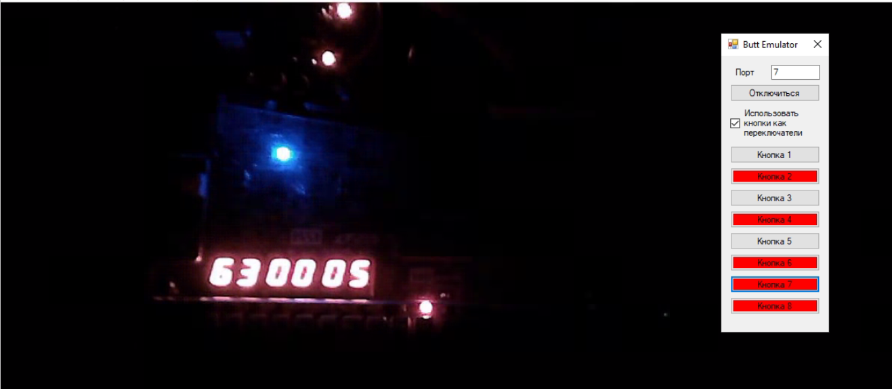
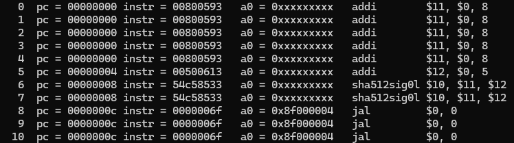
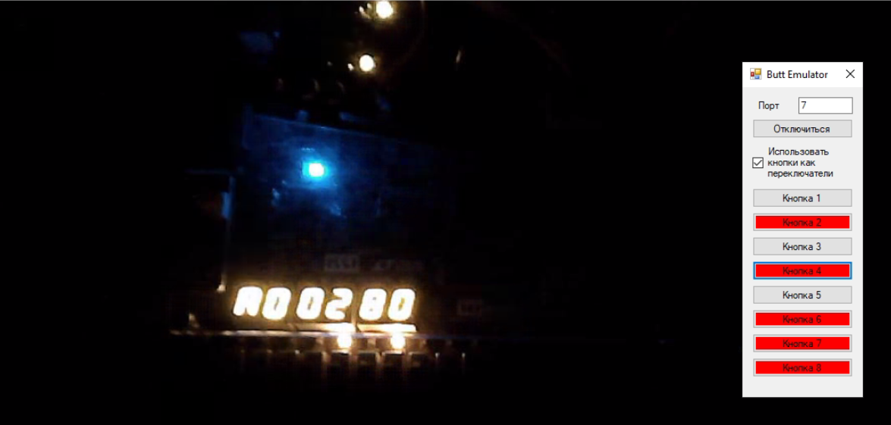

# Материалы сравнения

## Аппаратный подход

### aes32esmi

**Максимальная частота:**

**Загрузка на плату:**

**Потребление ресурсов:**

**Процесс симуляции программы:**

### aes32dsi

**Максимальная частота:**

**Загрузка на плату:**

**Потребление ресурсов:**

**Процесс симуляции программы:**

### aes32dsmi

**Максимальная частота:**

**Загрузка на плату:**

**Потребление ресурсов:**

**Процесс симуляции программы:**

### sha512sig1l

**Максимальная частота:**

**Загрузка на плату:**

**Потребление ресурсов:**

**Процесс симуляции программы:**

### sha512sig0h

**Максимальная частота:**

**Загрузка на плату:**

**Потребление ресурсов:**

**Процесс симуляции программы:**

### sha256sum0

**Максимальная частота:**

**Загрузка на плату:**

**Потребление ресурсов:**

**Процесс симуляции программы:**

### sha512sum1r

**Максимальная частота:**

**Загрузка на плату:**

**Потребление ресурсов:**

**Процесс симуляции программы:**

### sha512sum0r

**Максимальная частота:**

**Загрузка на плату:**

**Потребление ресурсов:**

**Процесс симуляции программы:**

### sha256sig0

**Максимальная частота:**

**Загрузка на плату:**

**Потребление ресурсов:**

**Процесс симуляции программы:**

### sha256sum1

**Максимальная частота:**

**Загрузка на плату:**

**Потребление ресурсов:**

**Процесс симуляции программы:**

### aes32esi

**Максимальная частота:**

**Загрузка на плату:**

**Потребление ресурсов:**

**Процесс симуляции программы:**

### sha256sig1

**Максимальная частота:**

**Загрузка на плату:**

**Потребление ресурсов:**

**Процесс симуляции программы:**

### sha512sig0l

**Максимальная частота:**

**Загрузка на плату:**

**Потребление ресурсов:**

**Процесс симуляции программы:**

### sha512sig1h

**Максимальная частота:**

**Загрузка на плату:**

**Потребление ресурсов:**

**Процесс симуляции программы:**

## Программный подход

### aes32dsi

**Процесс симуляции программы:**

### sha512sig1l

**Максимальная частота:**

**Загрузка на плату:**

**Потребление ресурсов:**

**Процесс симуляции программы:**

### sha512sig0h

**Максимальная частота:**

**Загрузка на плату:**

**Потребление ресурсов:**

**Процесс симуляции программы:**

### sha256sum0

**Максимальная частота:**

**Загрузка на плату:**

**Потребление ресурсов:**

**Процесс симуляции программы:**

### sha512sum1r

**Максимальная частота:**

**Загрузка на плату:**

**Потребление ресурсов:**

**Процесс симуляции программы:**

### sha512sum0r

**Максимальная частота:**

**Загрузка на плату:**

**Потребление ресурсов:**

**Процесс симуляции программы:**

### sha256sig0

**Максимальная частота:**

**Загрузка на плату:**

**Потребление ресурсов:**

**Процесс симуляции программы:**

### sha256sum1

**Максимальная частота:**

**Загрузка на плату:**

**Потребление ресурсов:**

**Процесс симуляции программы:**

### aes32esi

**Процесс симуляции программы:**

### sha256sig1

**Максимальная частота:**

**Загрузка на плату:**

**Потребление ресурсов:**

**Процесс симуляции программы:**

### sha512sig0l

**Максимальная частота:**

**Загрузка на плату:**

**Потребление ресурсов:**

**Процесс симуляции программы:**

### sha512sig1h

**Максимальная частота:**

**Загрузка на плату:**

**Потребление ресурсов:**

**Процесс симуляции программы:**

